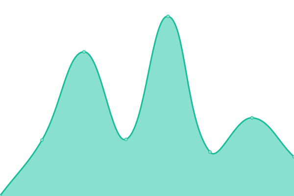
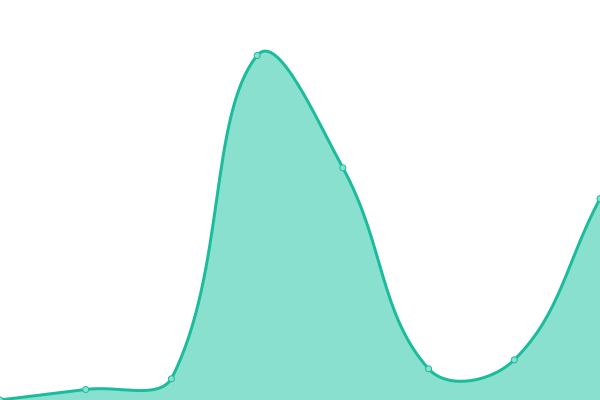

# [📈 Live Status](https://justenrokstad-acu.github.io/service-status): <!--live status--> **🟩 All systems operational**

This repository contains the open-source uptime monitor and status page for [justenrokstad-acu](https://justenrokstad-acu.github.io/service-status), powered by [Upptime](https://github.com/upptime/upptime).

With [Upptime](https://upptime.js.org), you can get your own unlimited and free uptime monitor and status page, powered entirely by a GitHub repository. We use [Issues](https://github.com/justenrokstad-acu/service-status/issues) as incident reports, [Actions](https://github.com/justenrokstad-acu/service-status/actions) as uptime monitors, and [Pages](https://justenrokstad-acu.github.io/service-status) for the status page.

<!--start: status pages-->
<!-- This summary is generated by Upptime (https://github.com/upptime/upptime) -->
<!-- Do not edit this manually, your changes will be overwritten -->
<!-- prettier-ignore -->
| URL | Status | History | Response Time | Uptime |
| --- | ------ | ------- | ------------- | ------ |
|  [Affinity Public Website](https://www.affinitycu.ca) | 🟩 Up | [affinity-public-website.yml](https://github.com/justenrokstad-acu/service-status/commits/HEAD/history/affinity-public-website.yml) | 

 473ms
     
 | 

<a href="https://justenrokstad-acu.github.io/service-status/history/affinity-public-website">100.00%</a>
    

|  [Retail Online Banking](https://personal.affinitycu.ca/) | 🟩 Up | [retail-online-banking.yml](https://github.com/justenrokstad-acu/service-status/commits/HEAD/history/retail-online-banking.yml) | 

 300ms
     
 | 

<a href="https://justenrokstad-acu.github.io/service-status/history/retail-online-banking">100.00%</a>
    

|  [Ovation SAM](https://acu-service-status.azurewebsites.net/api/Heartbeat) | 🟩 Up | [ovation-sam.yml](https://github.com/justenrokstad-acu/service-status/commits/HEAD/history/ovation-sam.yml) | 

 1888ms
     
 | 

<a href="https://justenrokstad-acu.github.io/service-status/history/ovation-sam">100.00%</a>
    

<!--end: status pages-->

[**Visit our status website →**](https://justenrokstad-acu.github.io/service-status)

## 📄 License

- Powered by: [Upptime](https://github.com/upptime/upptime)
- Code: [MIT](./LICENSE) © [justenrokstad-acu](https://justenrokstad-acu.github.io/service-status)
- Data in the `./history` directory: [Open Database License](https://opendatacommons.org/licenses/odbl/1-0/)
